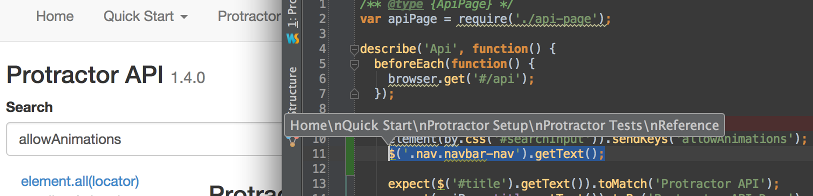
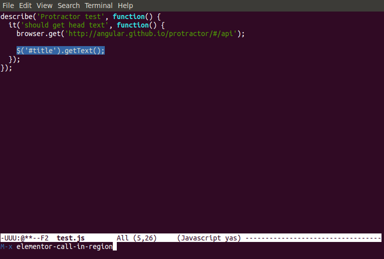

 elementor
=========

Elementor lets you test [Protractor](http://protractortest.org) selectors from
your browser and IDE. You can enter a protractor locator or expression and
elementor will test it against a live protractor instance.


## Video tutorial

[](http://www.youtube.com/watch?v=kC0JYp79tdo)

## Get elementor

Elementor is a Node.js application. Install it through npm:

```shell
$ npm install elementor -g
```

## How to launch

Elementor needs [chromedriver](https://sites.google.com/a/chromium.org/chromedriver/)
and a running [selenium server](http://www.seleniumhq.org/download/). To
download the dependencies and start the selenium server you need to use
protractor's webdriver manager. Open your terminal and run the following
commands:

```shell
# Get protractor
$ npm install protractor -g

# Download chromedriver and the selenium server
$ webdriver-manager update

# Start the server
$ webdriver-manager start
```

In another terminal run elementor with an optional url:

```shell
$ elementor https://angularjs.org
```

If you need to pass flags to chrome use the `--chrome` flag. Use spaces to
separate the flags.

```shell
$ elementor https://angularjs.org --chrome="--disable-web-security --some-other-flag=123"
```

For applications not using Angular, just add the `--nonAngular` flag:

```shell
$ elementor https://google.com --nonAngular
```

## How it works

Elementor extends protractor's elementexplorer in two ways:

* It opens a server on port 13000 that listens for commands.
* It launches chrome with a custom extension that lets you test on the browser.


The extension includes two components:

* A popup to enter protractor locators and expressions.
* A developer tools window to suggest locators for the selected element.

## Using the popup

The popup is located next to the omnibox. Open it, enter a locator or an
expression, and hit ENTER. The input will be evaluated by elementor and the
results will be displayed on the popup menu.

When you enter a locator starting with `by.<strategy>` (e.g. `by.css`, `by.model`,
`by.binding`, etc.) then it will be executed as a count expression
`element.all(<your locator>).count()`. For example:

`by.css('div')` will be evaluated as `element(by.css('div')).count()`

You can also enter commands:

* `browser.get('http://protractortest.org')`
* `element(by.css('.some-class')).getText()`
* `element(by.binding('someBinding')).sendKeys('hello')`


## Using the developer tools

The developer tools extension tries to find protractor locators for the
currently selected item. Go to Developer tools > Elements and then on the side
pane (Styles, Computed, etc.) choose protractor.


The DevTools extension is limited because you cannot use it in the same browser
tab launched by the elementor. To use the extension you need to duplicate the
first tab of the browser (right click on tab > duplicate). Once the dev tools in
the second tab is open then it will provide locator suggestions every time you
change the selected element in the elements tab.


When you open the DevTools window, ChromeDriver is automatically disconnected.
When ChromeDriver receives a command, if disconnected, it will attempt to close
the DevTools window and reconnect.
[source](https://sites.google.com/a/chromium.org/chromedriver/help/devtools-window-keeps-closing).

## Using the Webstorm / IntelliJ plugin

You can use elementor from your IDE with Webstorm or IntelliJ. Follow the
installation instructions
[here](https://github.com/andresdominguez/elementor-idea).



## Using the Sublime plugin

A sublime plugin is available. Follow the installation
[here](https://github.com/andresdominguez/elementor-sublime).


## Using the Emacs plugin

There is also an emacs plugin available [here](https://github.com/fixermark/elementor.el). Installation instructions are in the plugin's README.


